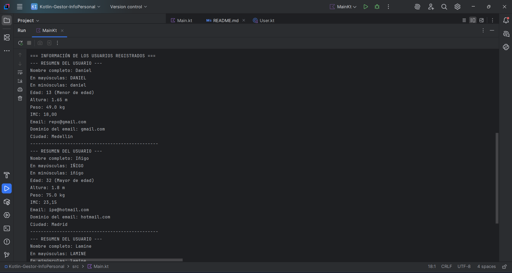

# 🧠 Gestor de Información Personal en Kotlin

## 📌 Descripción

Esta es una aplicación de consola desarrollada en Kotlin que permite registrar, validar, analizar y mostrar información personal de usuarios.

## 🎯 Funcionalidades

- Registro de al menos 3 usuarios.
- Validación de datos como edad, altura, peso y formato del email.
- Cálculo del Índice de Masa Corporal (IMC).
- Determinación de mayoría de edad.
- Manipulación de cadenas: nombre en mayúsculas/minúsculas, dominio del email.
- Presentación clara de datos con resúmenes personalizados.

## 🛠 Tecnologías usadas

- Kotlin
- IntelliJ IDEA Community Edition
- Entrada y salida por consola

## 🚀 Cómo ejecutar

1. Abre el proyecto en IntelliJ IDEA.
2. Abre `Main.kt`.
3. Haz clic derecho y selecciona `Run 'MainKt'`.
4. Ingresa los datos por consola cuando se soliciten.

## 📸 Ejemplo de ejecución

## 👤 Autor

Santiago Castaño Guerrero  
Proyecto de práctica – Curso de Kotlin
